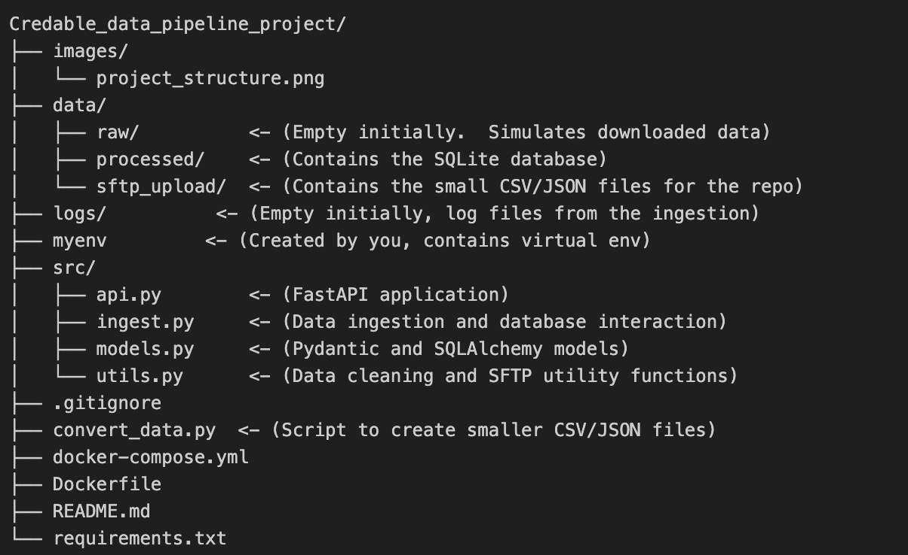

# Credable Data Pipeline

This project implements a data pipeline to ingest, clean, and serve NYC Yellow Taxi trip data. It demonstrates core data engineering concepts, including:

*   **Data Acquisition:** Simulates data retrieval from a remote SFTP server.
*   **Data Ingestion:** Loads data from CSV and JSON files into a SQLite database.
*   **Data Cleaning:** Performs comprehensive data cleaning, including handling missing values, outliers, data type conversions, and consistency checks.
*   **Data Transformation:** Calculates a new feature (`trip_duration`).
*   **Data Serving:** Provides a REST API to query the data, with pagination and filtering.
*   **Containerization:** Uses Docker and Docker Compose for a reproducible environment.
*   **Testing:** Includes unit tests for the data cleaning and API components.

## Project Structure



## Deliverables

### 1. Working Data Pipeline

*   **Automated Process:** The data ingestion and processing pipeline is implemented in the `src/ingest.py` script.  It can be run via Docker Compose:

    ```bash
    docker-compose up ingest
    ```
    This script handles connecting to the simulated SFTP server (running in a separate Docker container), downloading the data files, cleaning and transforming the data, and storing it in the SQLite database.

*   **Robustness and Data Inconsistencies:** The pipeline is designed to be robust and handle various data inconsistencies:
    *   **SFTP Handling:** The `src/utils.py` file contains the `sftp_transfer` function, which uses the `paramiko` library to connect to the SFTP server. It includes `try...except` blocks to handle potential connection errors, authentication failures, and file transfer issues.
    *   **File Format Handling:** The `src/ingest.py` script's `load_data` function detects the file type (CSV or JSON) based on the extension and uses the appropriate pandas function (`read_csv` or `read_json`) to load the data. It also handles unsupported file types gracefully.
    *   **Data Cleaning:**  The `src/utils.py` file's `clean_taxi_data` function performs extensive data cleaning:
        *   **Column Standardization:**  Column names are converted to lowercase and spaces are replaced with underscores.
        *   **Data Type Conversion:** Date/time columns are converted to pandas datetime objects, with error handling (`errors='coerce'`).  Integer columns are converted to pandas' nullable integer type (`Int64`).
        *   **Missing Value Handling:** Missing values are handled in several ways:
            *   `passenger_count` is imputed using the median.
            *   Other numeric columns are filled with -1.
            *   String columns are filled with "UNKNOWN".
        *   **Duplicate Removal:**  `drop_duplicates()` removes duplicate rows.
        *   **Invalid Data Filtering:** Rows with invalid data (e.g., zero trip distance, pickup time after dropoff time) are removed.
        *   **Outlier Removal:** The Interquartile Range (IQR) method is used to remove outliers in `trip_distance` and `fare_amount`.
        *   **String Consistency:**  The `store_and_fwd_flag` column is converted to uppercase and standardized.
    *   **Chunking:** The `load_data` function reads the data in chunks (using the `chunksize` parameter) to prevent out-of-memory errors when processing large files.
    *   **Error Logging:** The `loguru` library is used throughout the `ingest.py` and `utils.py` scripts to log errors and warnings, providing detailed information for debugging.
    * **Exception Handling:** The code contains several try/except block to catch potential exceptions.
    * **Database interactions:** Commitments are made after each row, preventing partial insertions. Rollbacks are done if an insertion fails.
*   **Curated Datasets:** The `store_data` function in `src/ingest.py` inserts the cleaned and transformed data into the `taxi_trips` table in the SQLite database (`data/processed/taxi_data.db`).  This table represents the curated dataset, ready for consumption by business users. The use of Pydantic models (`src/models.py`) helps ensure data consistency and provides a clear schema for the curated data.

### 2. API with Documentation

*   **Functional API:** The `src/api.py` script implements a FastAPI application that provides a `/taxi_trips/` endpoint for retrieving the processed data.
*   **Date-Based Filtering:** The API supports filtering by date range using the `start_date` and `end_date` query parameters (ISO 8601 format: `YYYY-MM-DDTHH:MM:SS`).
*   **Cursor-Based Pagination:** The API implements cursor-based pagination using the `cursor` and `limit` query parameters.  The `next_cursor` and `has_more` fields in the response provide information for retrieving subsequent pages of data.
*   **API Key Authentication:** The API includes basic API key authentication using the `api_key` query parameter. A placeholder key (`your_secret_api_key`) is used in the provided code; this should be replaced with a strong, randomly generated key in a production environment.
*   **Rate Limiting:** The API is rate-limited to 100 requests per minute using the `slowapi` library. This prevents abuse and ensures the API remains responsive.
*   **Documentation:** FastAPI automatically generates interactive API documentation using Swagger UI, accessible at `http://localhost:8000/docs`.  This documentation includes:
    *   A list of available endpoints.
    *   Descriptions of each endpoint, including parameters and response formats.
    *   Interactive "Try it out" functionality to test the API directly from the browser.
   
## Setup and Usage

**Prerequisites:**

*   Docker and Docker Compose installed.

**Steps:**

1.  **Clone the repository:**

    ```bash
    git clone <repository_url>
    cd <repository_directory>
    ```

2.  **Build and Run the Pipeline:**

    ```bash
    docker-compose up --build
    ```
    This command does the following:
    *   Builds the Docker images for the `ingest` and `api` services.
    *   Starts the `sftp_server`, `ingest`, and `api` containers.
    *   The `ingest` service:
        *   Downloads (simulates) the CSV and JSON data files from the `sftp_server` to the `data/raw` directory.
        *   Cleans and processes the data.
        *   Stores the cleaned data in the `data/processed/taxi_data.db` SQLite database.
    *   The `api` service starts a FastAPI server, accessible at `http://localhost:8000`.


3. **Access the API:**
   Once the `api` service is running, you can access it at `http://localhost:8000`.  The API provides a `/taxi_trips/` endpoint that supports:
    *   **Pagination:**  Use the `cursor` and `limit` query parameters.
    *   **Filtering:**  Use the `start_date` and `end_date` query parameters (format: `YYYY-MM-DDTHH:MM:SS`).
    *   **Rate Limiting:** The API is rate-limited to 100 requests per minute.
    * **API key authentication** To access the data you have to provide an `api_key`. The default value is `your_secret_api_key`.

    **Example API Calls:**

    *   Get the first 100 trips:

        ```bash
        curl "http://localhost:8000/taxi_trips/?api_key=your_secret_api_key&limit=100"
        ```

    *   Get trips between specific dates:

        ```bash
        curl "http://localhost:8000/taxi_trips/?api_key=your_secret_api_key&start_date=2023-01-05T10:00:00&end_date=2023-01-10T12:00:00"
        ```
    *   Get the next page of results (using the `next_cursor` from the previous response):

        ```bash
         curl "http://localhost:8000/taxi_trips/?api_key=your_secret_api_key&cursor=12345&limit=100" #Replace 12345

        ```

4.  **Stop the Services:**

    ```bash
    docker-compose down
    ```

## Data Source

The project uses a *reduced* version of the NYC Yellow Taxi trip record data for January and February 2023.  The full dataset is available from the TLC Trip Record Data website: [https://www.nyc.gov/site/tlc/about/tlc-trip-record-data.page](https://www.nyc.gov/site/tlc/about/tlc-trip-record-data.page).

**Reduced Dataset:**

To comply with GitHub's file size limits, the CSV and JSON files in the `data/sftp_upload` directory contain only a subset (the first 200,000 rows) of the original data.

**To use the full dataset (locally):**

1.  Download the Parquet files for January and February 2023 from the TLC website.
2.  Place the downloaded Parquet files in the project's root directory.
3.  Run `python convert_data.py yellow_tripdata_2023-01.parquet yellow_tripdata_2023-02.parquet`. This will not limit the rows, using the original files.
4.  Move the generated CSV and JSON files to the `data/sftp_upload/` directory, overwriting the existing (smaller) files.
5. Remove the `taxi_data.db` file.
6. Re-run `docker-compose up --build`.  This will ingest the full dataset.  *Note: This will take significantly longer.*

## Data Cleaning and Transformation

The `src/utils.py` file contains the `clean_taxi_data` function, which performs the following data cleaning steps:

1.  **Column Standardization:** Converts column names to lowercase and replaces spaces with underscores.
2.  **Date/Time Conversion:** Parses date/time columns, converting invalid values to `NaT`.
3.  **Missing Value Handling:**
    *   Imputes missing `passenger_count` values with the median.
    *   Fills missing numeric columns with -1.
    *   Fills missing string columns with "UNKNOWN".
4.  **Duplicate Removal:** Removes duplicate rows.
5.  **Invalid Data Filtering:** Removes rows with:
    *   Zero or negative `trip_distance`.
    *   Zero or negative `fare_amount`.
    *  `tpep_pickup_datetime` after `tpep_dropoff_datetime`.
6.  **Outlier Removal:**  Uses the Interquartile Range (IQR) method to remove outliers from `trip_distance` and `fare_amount`.
7.  **Data Type Consistency:** Ensures integer columns use pandas' nullable integer type (`Int64`).
8.  **String Value Handling:** Standardizes the `store_and_fwd_flag` column to uppercase ('N' or 'Y').
9.  **Feature Engineering:** Creates a new `trip_duration` column (in minutes).

## Database Schema

The project uses a SQLite database (`data/processed/taxi_data.db`).  The database contains a single table, `taxi_trips`, with the following schema:

| Column Name            | Data Type | Description                                                                                                                                         |
| :--------------------- | :-------- | :-------------------------------------------------------------------------------------------------------------------------------------------------- |
| `id`                   | INTEGER   | Primary key, auto-incrementing.                                                                                                                      |
| `vendor_id`            | BIGINT   | A code indicating the TPEP provider that provided the record.                                                                                        |
| `tpep_pickup_datetime` | DATETIME  | The date and time when the meter was engaged.                                                                                                         |
| `tpep_dropoff_datetime`| DATETIME  | The date and time when the meter was disengaged.                                                                                                       |
| `passenger_count`      | BIGINT    | The number of passengers in the vehicle.                                                                                                            |
| `trip_distance`        | FLOAT     | The elapsed trip distance in miles reported by the taximeter.                                                                                        |
| `rate_code_id`         | BIGINT     | The final rate code in effect at the end of the trip.                                                                                              |
| `store_and_fwd_flag`   | TEXT      | This flag indicates whether the trip record was held in vehicle memory before sending to the vendor, aka “store and forward,” because the vehicle did not have a connection to the server. |
| `pu_location_id`       | BIGINT    | TLC Taxi Zone in which the taximeter was engaged.                                                                                                 |
| `do_location_id`       | BIGINT   | TLC Taxi Zone in which the taximeter was disengaged.                                                                                               |
| `payment_type`         | BIGINT     | A numeric code signifying how the passenger paid for the trip.                                                                                   |
| `fare_amount`          | FLOAT     | The time-and-distance fare calculated by the meter.                                                                                                 |
| `extra`                | FLOAT     | Miscellaneous extras and surcharges.                                                                                                               |
| `mta_tax`              | FLOAT     | $0.50 MTA tax that is automatically triggered based on the metered rate in use.                                                                       |
| `tip_amount`           | FLOAT     | Tip amount – This field is automatically populated for credit card tips. Cash tips are not included.                                                  |
| `tolls_amount`         | FLOAT     | Total amount of all tolls paid in trip.                                                                                                              |
| `improvement_surcharge`| FLOAT     | $0.30 improvement surcharge assessed trips at the flag drop.                                                                                     |
| `total_amount`         | FLOAT     | The total amount charged to passengers. Does not include cash tips.                                                                                    |
| `congestion_surcharge` | FLOAT     | Total amount collected in trip for NYS congestion surcharge.                                                                                          |
| `airport_fee`          | FLOAT     | $1.25 for pick up only at LaGuardia and John F. Kennedy Airports.                                                                                     |
| `trip_duration`        | FLOAT     | Calculated trip duration in minutes.                                                                                                                 |

## Limitations

*   **Reduced Dataset:** The repository includes a reduced dataset for demonstration purposes due to file size limits. Instructions are provided to use the full dataset locally.
*   **Simplified SFTP Simulation:** The SFTP server is simulated using Docker for ease of setup. A real-world pipeline would connect to an actual SFTP server.
*   **SQLite Database:** SQLite is used for simplicity and portability.  A production system would likely use a more robust database like PostgreSQL or MySQL.
* **Single table database**: The database contains a single table. For a production ready solution, a relational database, with multiple tables may be needed.

## Potential Improvements

*   **Full Dataset Integration:** Integrate Git LFS to handle the full dataset within the repository.
*   **Database Migrations:** Implement database migrations (e.g., using Alembic) for schema changes.
*   **More Sophisticated Error Handling:**  Implement more robust error handling, including retries, dead-letter queues, and alerting.
*   **Configuration Management:** Use a configuration file (e.g., YAML) to manage settings like database URLs, API keys, and SFTP credentials.
*   **Data Validation:** Add more comprehensive data validation rules.
*   **Automated tests:** Implement automated tests to assert the validation rules.
*   **Performance Optimization:** Optimize database queries and data loading for performance.
*   **Monitoring and Logging:** Implement more detailed monitoring and logging, potentially using a dedicated logging framework.
* **Asynchronous Tasks** Use celery for example to perform tasks asynchronously.
* **Add Authentication to the API** Implement a more robust authentication.